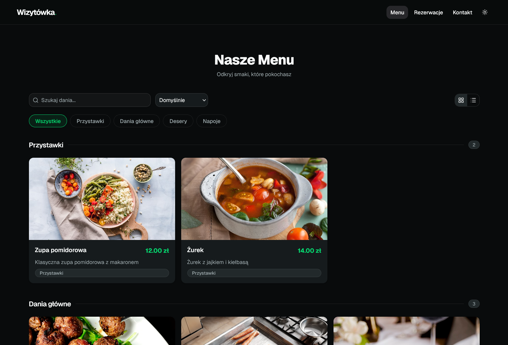
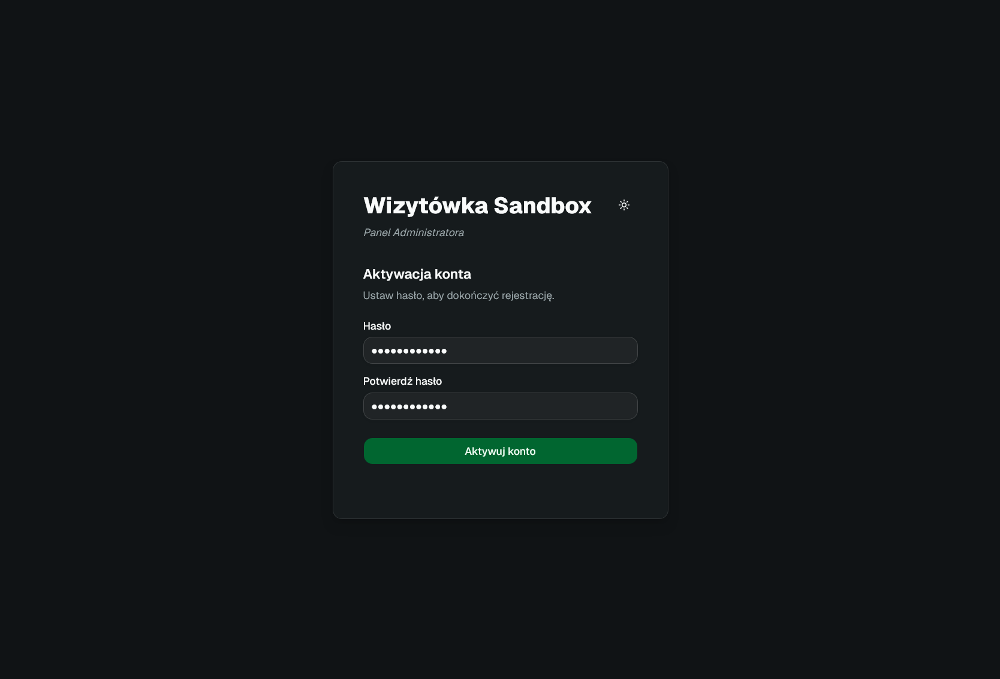
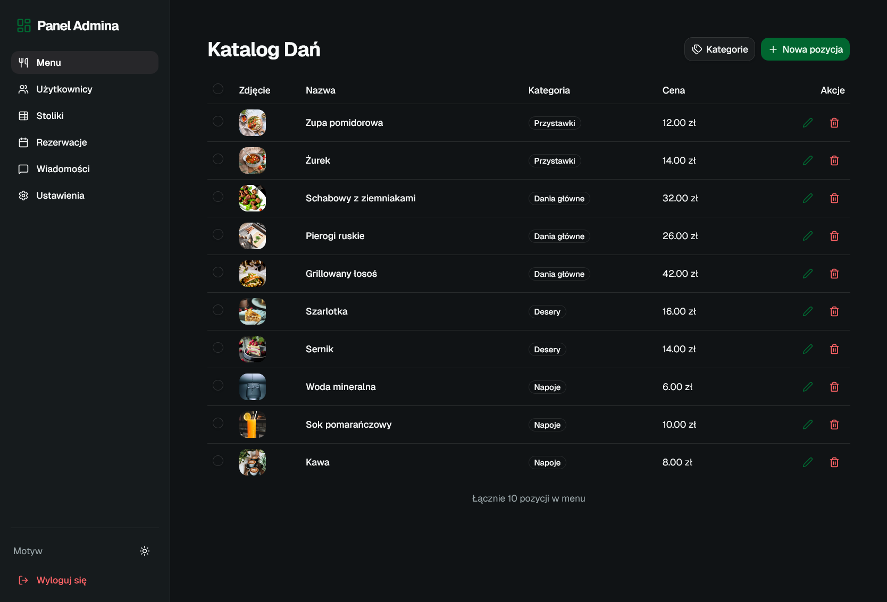
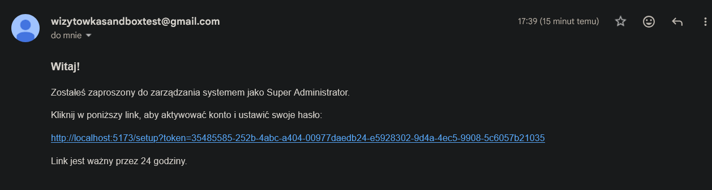
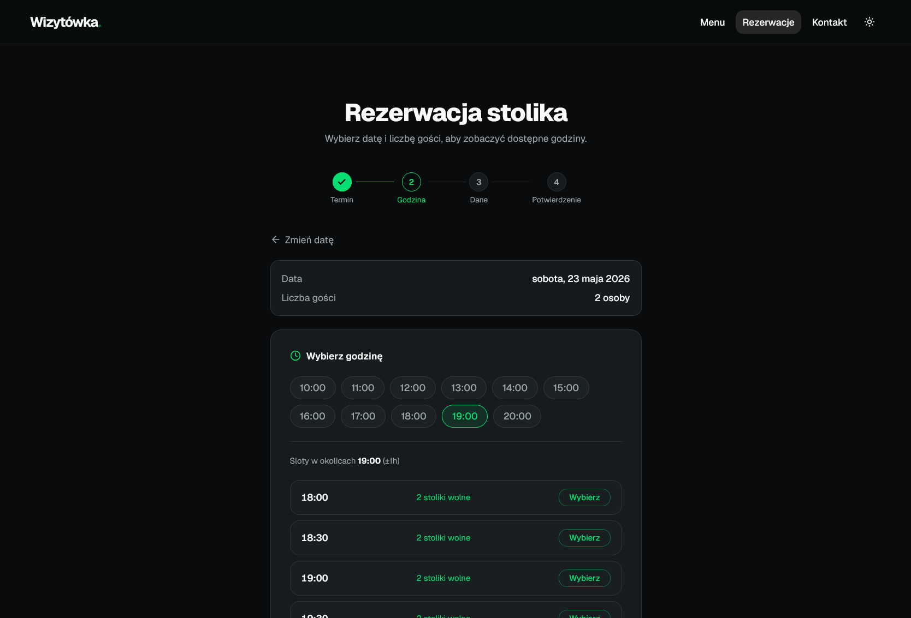
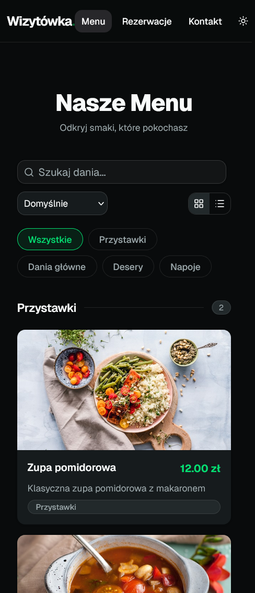
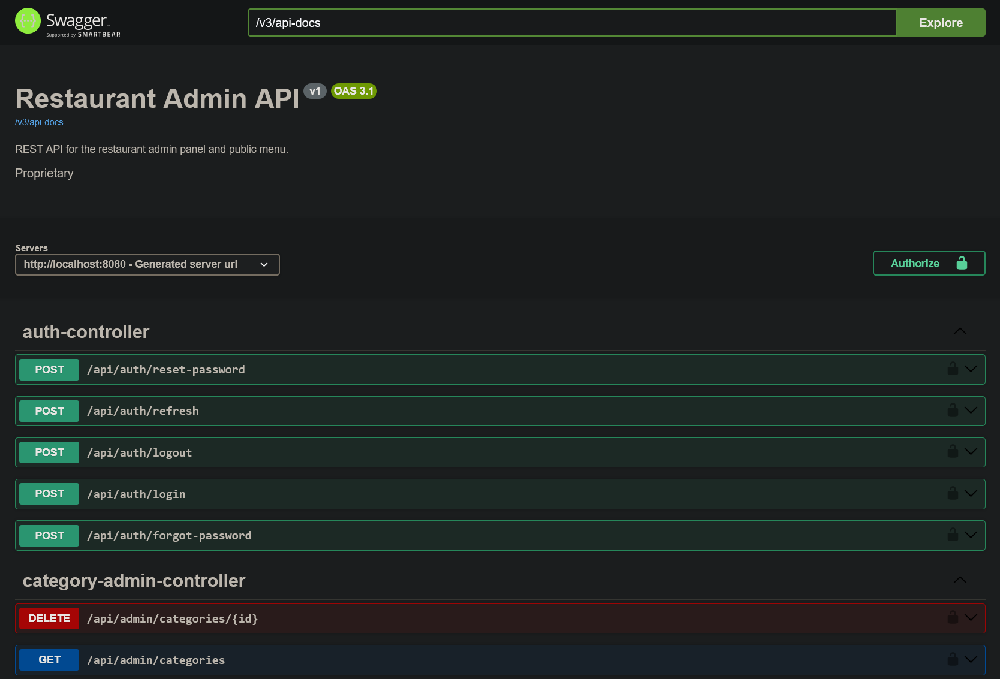
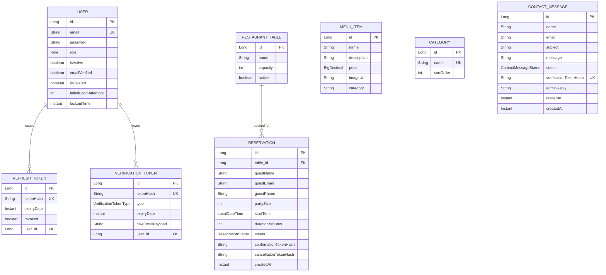

# Restaurant Admin Platform

Full-stack restaurant management system: public reservation/menu site + role-based admin panel. Built as a portfolio piece to practice production patterns — JWT auth with rotating refresh tokens, invitation-based onboarding, hashed verification tokens, and a clean interface-first service layer.

**Stack:** React 18 · Vite · TypeScript · TanStack Query · Zustand · shadcn/ui · Spring Boot · Spring Security · JPA/Hibernate · PostgreSQL · Docker Compose



---

## Features

**Public site**
- Browse menu by category (ordered server-side)
- Multi-step reservation flow with email confirmation + cancellation links
- Contact form with email verification (anti-spam)

**Admin panel**
- Menu & category CRUD with drag-style ordering
- Reservation management
- Table management
- Contact inbox with admin reply
- User management with role-based access (MASTER_USER / SUPER_USER) and invitation flow

**Auth & security**
- JWT access tokens (15 min) + UUID refresh tokens, rotated on each use
- All verification/refresh tokens stored **hashed**, never plaintext
- Reactive 401 interceptor + proactive refresh 60s before expiry
- Account lockout on repeated failed logins
- Soft-delete with reactivation on re-invite

---

## Screenshots

| | |
|---|---|
|  |  |
| Account activation via invitation link | Admin menu manager (CRUD + categories) |
|  |  |
| Invitation email (HTML template) | Public reservation flow |
|  |  |
| Reservation confirmation | Responsive public menu (mobile) |
|  | |
| OpenAPI / Swagger docs | |

---

## Architecture

```
┌──────────────┐    HTTPS / JWT     ┌──────────────────┐    JDBC     ┌────────────┐
│  React SPA   │ ◄─────────────────►│  Spring Boot API │ ◄──────────►│ PostgreSQL │
│  (Vite)      │                    │  (Security+JPA)  │             └────────────┘
└──────────────┘                    └────────┬─────────┘
                                             │ SMTP
                                             ▼
                                    ┌──────────────────┐
                                    │  Mail provider   │
                                    └──────────────────┘
```

### Database (ER diagram)



---

## Engineering decisions

A few non-obvious tradeoffs worth calling out:

- **Interface-first services** (`service/interfaces/` + `*Impl`) — keeps controllers testable and lets implementations swap without touching call sites.
- **Hashed tokens at rest** — refresh tokens, verification tokens, reservation confirmation/cancellation tokens all stored via `TokenHasher`. A DB leak doesn't hand over usable tokens.
- **Refresh-token rotation** — each refresh issues a new token and revokes the old. Replay of a stolen token is single-use.
- **Two-layer token refresh on the client** — `useTokenRefresh` schedules a refresh 60s before expiry; `axiosInstance` also reacts to 401s and retries. Belt + suspenders so a clock skew or missed timer doesn't log the user out.
- **JWT carries the role, backend `AuthResponse` does not** — role is decoded from the `authorities` claim client-side, keeping the response minimal and the JWT self-contained.
- **Soft-delete + reactivate on re-invite** — inviting an email that belongs to a soft-deleted user reactivates the account instead of erroring or creating a duplicate.
- **Split controller packages** (`controller/open` vs `controller/admin` vs `controller/profile`) — security rules map cleanly to URL prefixes; no per-endpoint annotation drift.
- **Account lockout** on `failedLoginAttempts` with `lockoutTime` — basic brute-force defense without external deps.

---

## Project structure

```
/frontend                     # React + Vite + TS
  src/
    components/{admin,auth,layout,ui}
    pages/{admin,auth,public}
    services/                 # axios + per-resource API clients
    hooks/                    # TanStack Query hooks
    stores/authStore.ts       # Zustand, persists to local/session storage
    layouts/                  # AdminLayout, AuthLayout, PublicLayout

/backend/backend              # Spring Boot
  src/main/java/pl/app/backend/
    controller/{open,admin,profile}
    service/{interfaces,*Impl}
    security/                 # JwtFilter, UserPrincipal, SecurityConfig
    entity/                   # JPA entities
    bootstrap/DatabaseSeeder.java
```

---

## Quick start

```bash
# 1. Backend (needs Postgres on localhost:5432, db=restaurant_db)
cd backend/backend
cp .env.example .env          # fill in SMTP + JWT secret
./mvnw spring-boot:run

# 2. Frontend
cd frontend
npm install
npm run dev                   # http://localhost:5173
```

Swagger UI: `http://localhost:8080/swagger-ui/index.html`

Or via Docker:

```bash
docker-compose up --build
```

---

## License

MIT — feel free to use as a learning reference.
